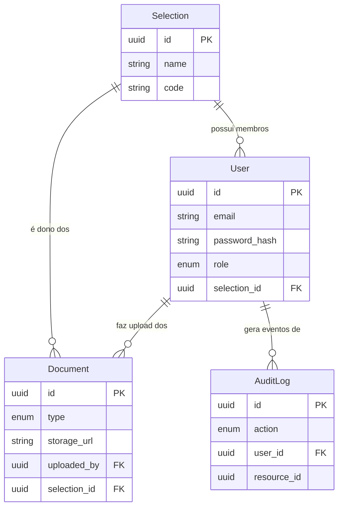

# Documentação de Arquitetura e Modelagem de Dados

Este documento descreve a estrutura de dados, as regras de negócio para isolamento de dados (*multi-tenancy*) e a matriz de controle de acesso do sistema **FIFA Team Hub**.

---

## 📊 1. Definição das Entidades Principais

Para atender aos requisitos mínimos do sistema, o banco de dados foi modelado com foco na integridade referencial e auditoria. Abaixo está o diagrama de relacionamento e os campos principais das quatro entidades fundamentais:

### 🔹 Seleção (`Selection`)

Representa o país e delimita o escopo de isolamento (Tenant).

* `id`: Identificador único (Primary Key).
* `nome`: Nome oficial da seleção (ex: "Brasil").
* `codigo`: Código FIFA de 3 letras (ex: "BRA").
* `created_at`: Data e hora de criação do registro.

### 🔹 Usuário (`User`)

Credenciais de acesso e definição de perfis globais ou vinculados a uma seleção.

* `id`: Identificador único (Primary Key).
* `email`: Email corporativo (Unique).
* `senha_hash`: Hash seguro da senha de acesso.
* `funcao`: Perfil de acesso (`TECHNICAL_STAFF`, `ORGANIZER`, `AUDITOR`).
* `selection_id`: Chave estrangeira (`Foreign Key -> Selection.id`). Permite valor nulo (`NULL`) apenas para Organizadores e Auditores.
* `created_at`: Data e hora de criação da conta.

### 🔹 Documento (`Document`)

Metadados dos arquivos oficiais enviados para a nuvem.

* `id`: Identificador único (Primary Key).
* `selection_id`: Chave estrangeira obrigatória (`Foreign Key -> Selection.id`).
* `uploaded_by`: Chave estrangeira (`Foreign Key -> User.id`).
* `type`: Tipo do arquivo (`OCAC`, `PASSAPORTE`, `LAUDO_MEDICO`, `RELATORIO_TATICO`, `ESQUEMA_JOGO`).
* `filename`: Nome do arquivo armazenado.
* `storage_url`: Link de acesso ao arquivo na Google Cloud Storage.
* `created_at`: Data e hora do envio.

### 🔹 Log Auditável (`AuditLog`)

Trilha imutável de eventos de segurança.

* `id`: Identificador único (Primary Key).
* `user_id`: Usuário que realizou a ação (`Foreign Key -> User.id`).
* `action`: Tipo da ação (`LOGIN`, `LOGOUT`, `UPLOAD`, `DOWNLOAD`, `DELETE`, `ACCESS_DENIED`).
* `resource_id`: Identificador do recurso afetado (ex: UUID do documento).
* `status`: Resultado da operação (`SUCCESS` ou `FAILED`).
* `ip_address`: Endereço IP de origem da requisição.
* `created_at`: Registro exato do instante do evento (Timestamp).

---

## 🔒 2. Estratégia de Isolamento entre Seleções

O requisito mais crítico do **FIFA Team Hub** é o isolamento completo de dados entre diferentes países (*Multi-tenancy* lógico).

> ⚠️ **Regra Absoluta:** Todo `Document` tem obrigatoriamente um `selection_id` válido e preenchido — **sem exceção**.

### Como o isolamento será garantido na camada de aplicação (Flask):

1. **Row-Level Filtering:** Toda consulta (`SELECT`) realizada para buscar documentos aplicará obrigatoriamente uma cláusula `WHERE documentos.selection_id = usuario_logado.selection_id`.
2. **Validação no Upload:** O backend injetará o `selection_id` do usuário da sessão diretamente no modelo do documento antes de salvar no banco, impedindo que um usuário manipule o payload para enviar arquivos para outra seleção.

---

## 🔑 3. Matriz de Permissões e Perfis de Usuário

O sistema opera com base em controle de acesso baseado em funções (RBAC). Abaixo estão documentados os limites operacionais de cada um dos 3 tipos de usuários:

| Perfil de Usuário | O que PODE fazer | O que NÃO PODE fazer |
| --- | --- | --- |
| **`TECHNICAL_STAFF`** *(Comissões, Médicos, Atletas)*  |  • Autenticar no sistema.  • Realizar upload de documentos da **sua** seleção.  • Listar e baixar documentos da **sua** seleção.  • Visualizar o histórico de ações da sua própria conta.   |    • Visualizar, baixar ou listar qualquer documento de **outra** seleção. • Criar ou excluir usuários.  • Visualizar logs globais do sistema.   |
| **`ORGANIZER`** *(Organizadores da FIFA/Admin)* |  • Cadastrar novas seleções no sistema. • Criar e gerenciar contas de usuários. • Visualizar o status de envio de documentos (metadados burocráticos). |  • Acessar o conteúdo confidencial de documentos táticos ou esquemas de jogos. • Alterar registros de logs de auditoria. |
| **`AUDITOR`** *(Auditores de Conformidade)* |  • Visualizar **todos** os logs de auditoria do sistema (`AuditLog`). • Rastrear tentativas de acessos negados (`ACCESS_DENIED`). • Auditar quem enviou e quem baixou arquivos. |  • Realizar uploads ou modificações de arquivos. • Alterar ou apagar registros de logs (os logs são de leitura exclusiva e imutáveis). • Alterar permissões de usuários. |