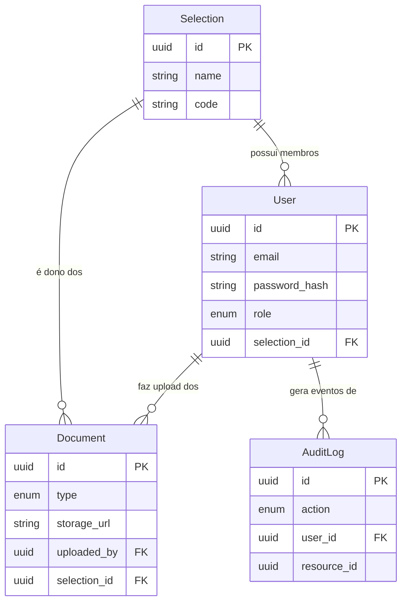

# Documentação de Arquitetura e Modelagem de Dados

Este documento descreve a estrutura de dados, as regras de negócio para isolamento de dados (*multi-tenancy*) e a matriz de controle de acesso do sistema **FIFA Team Hub**.

---

## 📊 1. Definição das Entidades Principais

Para atender aos requisitos mínimos do sistema, o banco de dados foi modelado com foco na integridade referencial e auditoria. Abaixo está o diagrama de relacionamento e os campos principais das quatro entidades fundamentais:

### 🔹 Seleção (`Selection`)

Representa o país e delimita o escopo de isolamento (Tenant).

* `id`: Identificador único (Primary Key).
* `nome`: Nome oficial da seleção (ex: "Brasil").
* `codigo`: Código FIFA de 3 letras (ex: "BRA").
* `created_at`: Data e hora de criação do registro.

### 🔹 Usuário (`User`)

Credenciais de acesso e definição de perfis globais ou vinculados a uma seleção.

* `id`: Identificador único (Primary Key).
* `email`: Email corporativo (Unique).
* `senha_hash`: Hash seguro da senha de acesso.
* `funcao`: Perfil de acesso (`ATHELETE`, `TECHNICAL_STAFF`, `MEDICAL_STAFF`, `ORGANIZER`, `AUDITOR`).
* `selection_id`: Chave estrangeira (`Foreign Key -> Selection.id`). Permite valor nulo (`NULL`) apenas para Organizadores e Auditores.
* `created_at`: Data e hora de criação da conta.

### 🔹 Documento (`Document`)

Metadados dos arquivos oficiais enviados para a nuvem.

* `id`: Identificador único (Primary Key).
* `selection_id`: Chave estrangeira obrigatória (`Foreign Key -> Selection.id`).
* `uploaded_by`: Chave estrangeira (`Foreign Key -> User.id`).
* `type`: Tipo do arquivo (`OCAC`, `PASSAPORTE`, `LAUDO_MEDICO`, `RELATORIO_TATICO`, `ESQUEMA_JOGO`).
* `filename`: Nome do arquivo armazenado.
* `storage_url`: Link de acesso ao arquivo na Google Cloud Storage.
* `created_at`: Data e hora do envio.

### 🔹 Log Auditável (`AuditLog`)

Trilha imutável de eventos de segurança.

* `id`: Identificador único (Primary Key).
* `user_id`: Usuário que realizou a ação (`Foreign Key -> User.id`).
* `action`: Tipo da ação (`LOGIN`, `LOGOUT`, `UPLOAD`, `DOWNLOAD`, `DELETE`, `ACCESS_DENIED`).
* `resource_id`: Identificador do recurso afetado (ex: UUID do documento).
* `status`: Resultado da operação (`SUCCESS`, `FAILURE` ou `ACCESS_DENIED`).
* `ip_address`: Endereço IP de origem da requisição.
* `created_at`: Registro exato do instante do evento (Timestamp).

---

## 🔒 2. Estratégia de Isolamento entre Seleções

O requisito mais crítico do **FIFA Team Hub** é o isolamento completo de dados entre diferentes países (*Multi-tenancy* lógico).

> ⚠️ **Regra Absoluta:** Todo `Document` tem obrigatoriamente um `selection_id` válido e preenchido — **sem exceção**.

### Como o isolamento será garantido na camada de aplicação (Flask):

1. **Row-Level Filtering:** Toda consulta (`SELECT`) realizada para buscar documentos aplicará obrigatoriamente uma cláusula `WHERE documentos.selection_id = usuario_logado.selection_id`.
2. **Validação no Upload:** O backend injetará o `selection_id` do usuário da sessão diretamente no modelo do documento antes de salvar no banco, impedindo que um usuário manipule o payload para enviar arquivos para outra seleção.

---

## 🔑 3. Matriz de Permissões e Perfis de Usuário

O sistema opera com base em controle de acesso baseado em funções (RBAC), com **5 perfis** (`UserRole`):

| Perfil de Usuário | O que PODE fazer | O que NÃO PODE fazer |
| --- | --- | --- |
| **`ATHELETE`** *(sic — grafia usada no enum do código)* |  • Autenticar no sistema (após aprovação do cadastro). • Fazer upload de `PASSPORT` e `LAUDO_MEDICO` da **sua** seleção. • Listar/baixar documentos da **sua** seleção. |  • Acessar documentos de **outra** seleção. • Revisar (aprovar/rejeitar) documentos. • Ver logs de auditoria. |
| **`TECHNICAL_STAFF`** |  • Fazer upload de `CONVOCADO`, `RELATORIO_TATICO` e `PASSPORT` da **sua** seleção. • Listar/baixar documentos da **sua** seleção. |  • Acessar documentos de outra seleção. • Revisar documentos (nenhum tipo é revisável por este perfil). • Ver logs de auditoria. |
| **`MEDICAL_STAFF`** |  • Fazer upload de `LAUDO_MEDICO` e `PASSPORT` da **sua** seleção. • Revisar (aprovar/rejeitar) `LAUDO_MEDICO` da própria seleção, exceto os que ele mesmo enviou. |  • Acessar documentos de outra seleção. • Revisar `PASSPORT`. |
| **`ORGANIZER`** *(Organizadores da FIFA/Admin)* |  • Cadastrar novas seleções e o primeiro `AUDITOR` de cada uma (`POST /api/selection/`). • Confirmar nomeações de novos `AUDITOR` indicados por outro `AUDITOR`. • Visualizar `PASSPORT`/`CONVOCADO` de **todas** as seleções (metadados). |  • Fazer upload de documentos. • Acessar o conteúdo de documentos táticos ou laudos médicos. • Ver logs de auditoria. • Aprovar cadastros comuns (isso é papel do `AUDITOR`). |
| **`AUDITOR`** *(Auditores de Conformidade)* |  • Visualizar os logs de auditoria (`AuditLog`) da **própria seleção** (ou globais, se não vinculado a nenhuma). • Aprovar/rejeitar cadastros `PENDING` da própria seleção. • Indicar outro usuário para `AUDITOR` (fica pendente até confirmação do `ORGANIZER`). • Fazer upload de `PASSPORT`. • Revisar `PASSPORT` (exceto os que ele mesmo enviou). |  • Listar/baixar documentos pela rota geral de documentos (`403` — auditor só acessa o endpoint de auditoria). • Alterar ou apagar registros de logs (leitura exclusiva e imutável). |

> **Nota:** todo cadastro criado por autocadastro (`POST /auth/register`) nasce `ATHELETE`/`PENDING` — a atribuição de qualquer outro papel acontece apenas no momento da aprovação (`POST /api/auth/registrations/<id>/approve`), nunca no registro em si. Ver [API de Autenticação](api-auth.md).